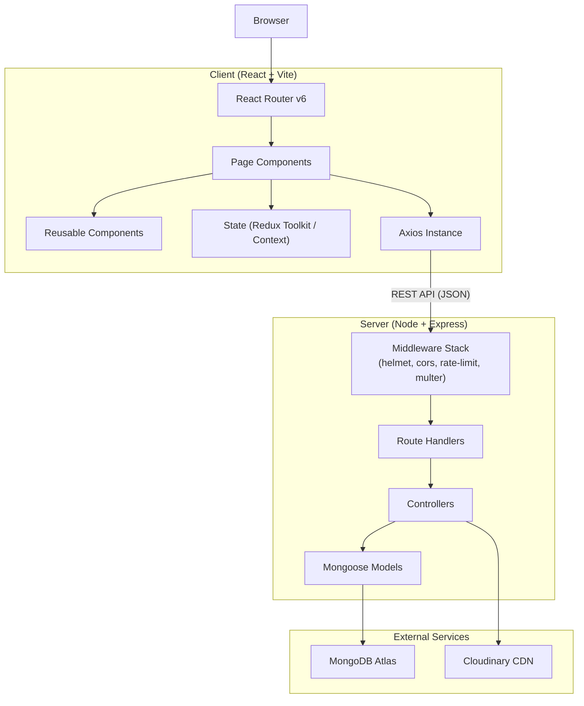
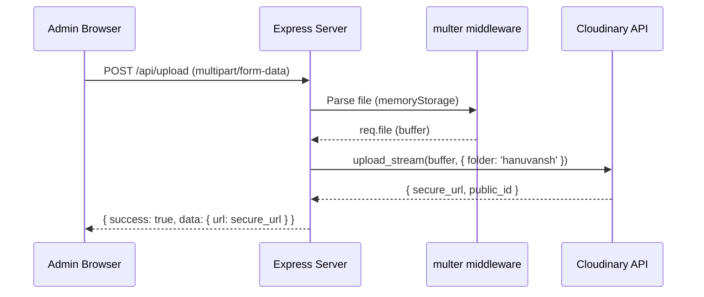
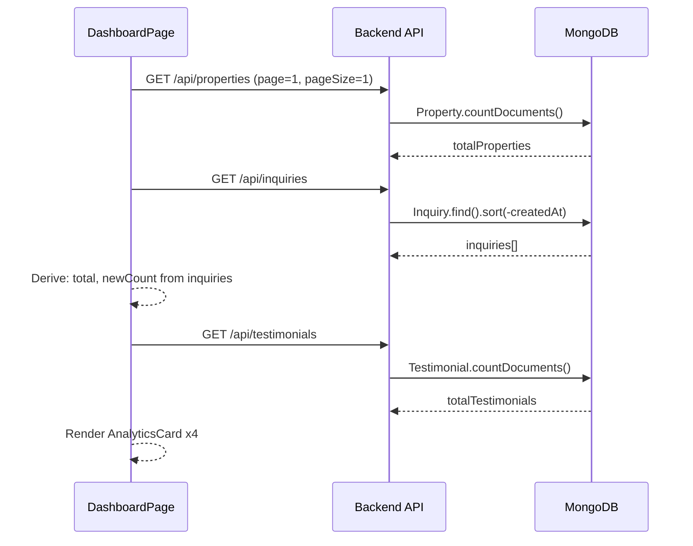

# Design Document: HANUVANSH ESTATE CONSULTANT

## Overview

HANUVANSH ESTATE CONSULTANT is a full-stack luxury real estate platform built on the MERN stack. It serves two audiences: public Visitors who browse properties and submit inquiries, and authenticated Admins who manage listings, inquiries, and testimonials through a protected dashboard. The platform emphasizes a premium dark-luxury aesthetic with orange/Bhagwa accent colors, gold highlights, glassmorphism effects, and Framer Motion animations.

**Core Goals:**
- Deliver a visually premium, responsive public-facing property portal
- Provide a secure, full-featured admin dashboard for content management
- Maintain clean separation between client and server concerns
- Follow security best practices (JWT auth, helmet, rate limiting, input sanitization)
- Integrate Cloudinary for optimized image delivery

---

## Architecture

### High-Level System Architecture



### Monorepo Folder Structure

```
hanuvansh-mern-estate/
├── package.json                  # Root: concurrently scripts
├── .env.example
├── client/                       # React + Vite frontend
│   ├── package.json
│   ├── vite.config.js
│   ├── tailwind.config.js
│   ├── postcss.config.js
│   ├── index.html
│   └── src/
│       ├── main.jsx
│       ├── App.jsx
│       ├── api/
│       │   └── axiosInstance.js  # Configured Axios with interceptors
│       ├── assets/               # Static images, fonts
│       ├── components/
│       │   ├── common/           # Navbar, Footer, SkeletonLoader, etc.
│       │   ├── property/         # PropertyCard, PropertyGallery, etc.
│       │   ├── forms/            # InquiryForm, LoginForm
│       │   └── admin/            # AdminLayout, ProtectedRoute, etc.
│       ├── pages/
│       │   ├── public/           # Home, About, Founder, Properties, etc.
│       │   └── admin/            # Dashboard, Properties, Inquiries, etc.
│       ├── store/                # Redux Toolkit slices or Context providers
│       ├── hooks/                # Custom React hooks
│       ├── utils/                # formatPrice, formatDate, validators
│       └── styles/               # Global CSS, animation variants
└── server/                       # Express backend
    ├── package.json
    ├── server.js                 # Entry point
    └── src/
        ├── config/
        │   ├── db.js             # Mongoose connection
        │   └── cloudinary.js     # Cloudinary SDK config
        ├── models/
        │   ├── User.js
        │   ├── Property.js
        │   ├── Inquiry.js
        │   └── Testimonial.js
        ├── controllers/
        │   ├── authController.js
        │   ├── propertyController.js
        │   ├── uploadController.js
        │   ├── inquiryController.js
        │   └── testimonialController.js
        ├── routes/
        │   ├── authRoutes.js
        │   ├── propertyRoutes.js
        │   ├── uploadRoutes.js
        │   ├── inquiryRoutes.js
        │   └── testimonialRoutes.js
        └── middleware/
            ├── authMiddleware.js
            ├── adminMiddleware.js
            ├── errorHandler.js
            └── uploadMiddleware.js
```

---

## Components and Interfaces

### Backend Middleware Stack

The Express app applies middleware in this order:

```
Request
  → helmet()                    # Secure HTTP headers
  → cors({ origin: CLIENT_URL }) # CORS whitelist
  → express.json()              # JSON body parsing
  → express.urlencoded()        # URL-encoded body parsing
  → loginRateLimiter            # Rate limit on /api/auth/login only
  → Routes
  → errorHandler                # Global error handler (last)
```

### API Route Structure

| Method | Path | Auth | Description |
|--------|------|------|-------------|
| POST | /api/auth/register | Public | Register new user, returns JWT |
| POST | /api/auth/login | Public (rate-limited) | Login, returns JWT |
| GET | /api/properties | Public | Paginated property list with filters |
| GET | /api/properties/featured | Public | Featured properties only |
| GET | /api/properties/:id | Public | Single property by ID |
| POST | /api/properties | Admin | Create new property |
| PUT | /api/properties/:id | Admin | Update property |
| DELETE | /api/properties/:id | Admin | Delete property |
| POST | /api/upload | Admin | Upload image(s) to Cloudinary |
| POST | /api/inquiries | Public | Submit inquiry |
| GET | /api/inquiries | Admin | List all inquiries |
| PUT | /api/inquiries/:id | Admin | Update inquiry status |
| DELETE | /api/inquiries/:id | Admin | Delete inquiry |
| GET | /api/testimonials | Public | List all testimonials |
| POST | /api/testimonials | Admin | Create testimonial |
| DELETE | /api/testimonials/:id | Admin | Delete testimonial |

### Controller Pattern

Each controller exports named async functions. All controllers follow this pattern:

```javascript
// Example: propertyController.js
export const getProperties = async (req, res, next) => {
  try {
    // business logic
    res.json({ success: true, data: result });
  } catch (err) {
    next(err); // forwarded to global errorHandler
  }
};
```

The global `errorHandler` middleware catches all forwarded errors and returns:
```json
{ "success": false, "message": "<descriptive error message>" }
```

### Authentication Middleware Interfaces

```javascript
// authMiddleware.js
// Reads Authorization: Bearer <token>, verifies JWT, attaches req.user
export const authMiddleware = (req, res, next) => { ... };

// adminMiddleware.js
// Checks req.user.role === 'admin', must run after authMiddleware
export const adminMiddleware = (req, res, next) => { ... };
```

### Axios Instance Interface

```javascript
// client/src/api/axiosInstance.js
const api = axios.create({
  baseURL: import.meta.env.VITE_API_URL,
  timeout: 15000,
});

// Request interceptor: attach JWT
api.interceptors.request.use((config) => {
  const token = localStorage.getItem('adminToken');
  if (token) config.headers.Authorization = `Bearer ${token}`;
  return config;
});

// Response interceptor: handle 401
api.interceptors.response.use(
  (response) => response,
  (error) => {
    if (error.response?.status === 401) {
      localStorage.removeItem('adminToken');
      window.location.href = '/admin/login';
    }
    return Promise.reject(error);
  }
);
```

### Frontend Route Tree

```
App
├── PublicLayout (Navbar + Footer)
│   ├── /                     → HomePage
│   ├── /about                → AboutPage
│   ├── /founder              → FounderPage
│   ├── /properties           → PropertyListingPage
│   ├── /properties/:id       → PropertyDetailPage
│   └── /contact              → ContactPage
├── AdminLayout
│   ├── /admin/login          → AdminLoginPage (public)
│   └── ProtectedRoute
│       ├── /admin/dashboard  → DashboardPage
│       ├── /admin/properties → AdminPropertiesPage
│       ├── /admin/properties/add → AddPropertyPage
│       ├── /admin/properties/edit/:id → EditPropertyPage
│       ├── /admin/inquiries  → AdminInquiriesPage
│       └── /admin/testimonials → AdminTestimonialsPage
└── *                         → NotFoundPage
```

---

## Data Models

### User Model

```javascript
const userSchema = new mongoose.Schema({
  name:      { type: String, required: true, trim: true },
  email:     { type: String, required: true, unique: true, lowercase: true, trim: true },
  password:  { type: String, required: true },          // bcrypt hash, salt rounds: 10
  role:      { type: String, enum: ['admin', 'user'], default: 'user' },
  createdAt: { type: Date, default: Date.now },
});

// Pre-save hook: hash password if modified
userSchema.pre('save', async function (next) {
  if (!this.isModified('password')) return next();
  this.password = await bcrypt.hash(this.password, 10);
  next();
});

// Instance method: compare password
userSchema.methods.comparePassword = async function (candidate) {
  return bcrypt.compare(candidate, this.password);
};
```

**Indexes:** `email` (unique)

### Property Model

```javascript
const propertySchema = new mongoose.Schema({
  name:          { type: String, required: true, trim: true },
  location:      { type: String, required: true, trim: true },
  type:          { type: String, enum: ['Apartment','Villa','Plot','Commercial','Penthouse'], required: true },
  price:         { type: Number, required: true, min: 0 },
  configuration: { type: String, required: true, trim: true },
  status:        { type: String, enum: ['Available','Sold','Under Construction'], required: true },
  amenities:     [{ type: String, trim: true }],
  images:        [{ type: String }],                    // Cloudinary secure URLs
  mapCoordinates: {
    lat: { type: Number },
    lng: { type: Number },
  },
  nearbyPlaces:  [{ type: String, trim: true }],
  description:   { type: String, trim: true },
  featured:      { type: Boolean, default: false },
  createdAt:     { type: Date, default: Date.now },
});
```

**Indexes:** `type`, `status`, `featured`, `price` (for filter queries)

### Inquiry Model

```javascript
const inquirySchema = new mongoose.Schema({
  name:       { type: String, required: true, trim: true },
  email:      { type: String, required: true, trim: true, lowercase: true },
  phone:      { type: String, required: true, trim: true },
  message:    { type: String, required: true, trim: true },
  propertyId: { type: mongoose.Schema.Types.ObjectId, ref: 'Property', default: null },
  status:     { type: String, enum: ['New','Contacted','Closed'], default: 'New' },
  createdAt:  { type: Date, default: Date.now },
});
```

**Indexes:** `status`, `createdAt` (for admin sorting/filtering)

### Testimonial Model

```javascript
const testimonialSchema = new mongoose.Schema({
  clientName:  { type: String, required: true, trim: true },
  clientTitle: { type: String, trim: true },
  message:     { type: String, required: true, trim: true },
  rating:      { type: Number, required: true, min: 1, max: 5 },
  avatar:      { type: String },                        // Cloudinary URL, optional
  createdAt:   { type: Date, default: Date.now },
});
```

**Indexes:** `createdAt` (for sorted retrieval)

---

## Image Upload Flow



**Implementation detail:** `multer` is configured with `memoryStorage()` so the file buffer is available in memory. The buffer is piped into `cloudinary.uploader.upload_stream()` wrapped in a Promise. File type validation (`image/jpeg`, `image/png`, `image/webp`) and size limit (10 MB) are enforced in the multer `fileFilter` and `limits` options respectively.

```javascript
const storage = multer.memoryStorage();
const upload = multer({
  storage,
  limits: { fileSize: 10 * 1024 * 1024 }, // 10 MB
  fileFilter: (req, file, cb) => {
    const allowed = ['image/jpeg', 'image/png', 'image/webp'];
    if (allowed.includes(file.mimetype)) cb(null, true);
    else cb(new Error('Invalid file type'), false);
  },
});
```

---

## Frontend Architecture

### State Management

Redux Toolkit is the recommended choice for this project due to the complexity of admin state (properties, inquiries, testimonials) and the need for async thunks. The store shape:

```javascript
{
  auth: {
    token: string | null,       // from localStorage
    isAuthenticated: boolean,
    loading: boolean,
    error: string | null,
  },
  properties: {
    items: Property[],
    featured: Property[],
    selected: Property | null,
    pagination: { page, totalPages, total },
    filters: { type, minPrice, maxPrice, configuration, status },
    loading: boolean,
    error: string | null,
  },
  inquiries: {
    items: Inquiry[],
    loading: boolean,
    error: string | null,
  },
  testimonials: {
    items: Testimonial[],
    loading: boolean,
    error: string | null,
  },
  ui: {
    toastMessage: string | null,
    toastType: 'success' | 'error' | null,
  }
}
```

### Component Architecture

**Common Components (`components/common/`):**
- `Navbar` — sticky, glassmorphism, scroll-opacity effect, mobile hamburger menu
- `Footer` — logo, tagline, nav links, social icons, WhatsApp button, copyright
- `SkeletonLoader` — configurable skeleton card for loading states
- `Toast` — success/error notification overlay
- `ConfirmDialog` — modal confirmation for destructive actions
- `LoadingSpinner` — luxury spinner for page-level loading
- `ErrorBoundary` — React error boundary wrapping route components
- `PageTransition` — Framer Motion wrapper for route-level animations

**Property Components (`components/property/`):**
- `PropertyCard` — displays name, location, type, price (INR format), config, status badge, primary image; hover animation
- `PropertyGallery` — image grid with lightbox/fullscreen on click
- `AmenitiesGrid` — icon-label pairs for amenities
- `NearbyPlaces` — list of nearby places
- `MapEmbed` — Google Maps iframe with lat/lng props
- `SearchFilter` — filter panel with controlled inputs, triggers re-fetch on change

**Form Components (`components/forms/`):**
- `InquiryForm` — name, email, phone, message fields; optional propertyId hidden field; validation; success/error state
- `LoginForm` — email, password; error display

**Admin Components (`components/admin/`):**
- `ProtectedRoute` — reads JWT from localStorage, redirects to `/admin/login` if absent
- `AdminLayout` — sidebar navigation, header with logout button
- `AnalyticsCard` — stat display card (icon, label, value)
- `PropertyTable` — sortable table with edit/delete actions
- `InquiryTable` — table with status dropdown per row
- `TestimonialList` — card list with delete action
- `ImageUploader` — drag-and-drop or click-to-upload, calls POST /api/upload, previews URLs

**Page Components (`pages/public/`):**
- `HomePage` — Hero, FeaturedProperties, CompanyIntro, Testimonials, PremiumCTA sections
- `AboutPage` — hero banner, history, philosophy, core values, founder teaser
- `FounderPage` — profile layout, achievements, vision, connect section
- `PropertyListingPage` — SearchFilter + property grid + pagination
- `PropertyDetailPage` — gallery, details, amenities, map, InquiryForm
- `ContactPage` — InquiryForm, WhatsApp button, map, social links, contact info
- `NotFoundPage` — styled 404 with back link

**Page Components (`pages/admin/`):**
- `AdminLoginPage`
- `DashboardPage`
- `AdminPropertiesPage`
- `AddPropertyPage`
- `EditPropertyPage`
- `AdminInquiriesPage`
- `AdminTestimonialsPage`

---

## UI Design System

### Tailwind Configuration

```javascript
// tailwind.config.js
export default {
  content: ['./index.html', './src/**/*.{js,jsx}'],
  theme: {
    extend: {
      colors: {
        // Dark luxury backgrounds
        'bg-primary':   '#0a0a0a',
        'bg-secondary': '#111111',
        'bg-card':      '#1a1a1a',
        // Orange/Bhagwa accent
        'accent':       '#FF6B00',
        'accent-light': '#FF8C00',
        // Gold highlight
        'gold':         '#D4AF37',
        'gold-light':   '#FFD700',
        // Text
        'text-primary': '#FFFFFF',
        'text-muted':   '#9CA3AF',
      },
      fontFamily: {
        heading: ['"Playfair Display"', 'serif'],
        body:    ['"Inter"', 'sans-serif'],
      },
      backdropBlur: {
        xs: '2px',
      },
      animation: {
        'counter': 'counter 2s ease-out forwards',
        'shimmer': 'shimmer 1.5s infinite',
      },
    },
  },
  plugins: [],
};
```

### Glassmorphism Utility Classes

```css
/* Applied to Navbar, cards, modals */
.glass {
  background: rgba(26, 26, 26, 0.7);
  backdrop-filter: blur(12px);
  -webkit-backdrop-filter: blur(12px);
  border: 1px solid rgba(212, 175, 55, 0.15);
}
```

### Framer Motion Animation Patterns

```javascript
// Page transition wrapper
export const pageVariants = {
  initial: { opacity: 0, y: 20 },
  animate: { opacity: 1, y: 0, transition: { duration: 0.4, ease: 'easeOut' } },
  exit:    { opacity: 0, y: -20, transition: { duration: 0.3 } },
};

// Scroll-triggered section reveal
export const sectionVariants = {
  hidden:  { opacity: 0, y: 40 },
  visible: { opacity: 1, y: 0, transition: { duration: 0.6, ease: 'easeOut' } },
};
// Used with: <motion.div variants={sectionVariants} initial="hidden" whileInView="visible" viewport={{ once: true }} />

// PropertyCard hover
export const cardHoverVariants = {
  rest:  { scale: 1, boxShadow: '0 4px 20px rgba(0,0,0,0.3)' },
  hover: { scale: 1.02, boxShadow: '0 8px 40px rgba(255,107,0,0.25)', transition: { duration: 0.2 } },
};

// Staggered children (e.g., property grid)
export const containerVariants = {
  hidden:  { opacity: 0 },
  visible: { opacity: 1, transition: { staggerChildren: 0.1 } },
};

// Hero entrance
export const heroVariants = {
  initial: { opacity: 0, scale: 1.05 },
  animate: { opacity: 1, scale: 1, transition: { duration: 0.8, ease: 'easeOut' } },
};
```

---

## Admin Dashboard Design

### Protected Route Wrapper

```jsx
// ProtectedRoute.jsx
const ProtectedRoute = ({ children }) => {
  const token = localStorage.getItem('adminToken');
  if (!token) return <Navigate to="/admin/login" replace />;
  return children;
};
```

### Dashboard Layout

The admin layout uses a two-column structure: a fixed sidebar (240px) and a scrollable main content area. The sidebar contains navigation links to all admin sections and a logout button at the bottom.

### Analytics Cards Data Flow



**Design decision:** Rather than a dedicated `/api/stats` endpoint, the dashboard derives counts from existing list endpoints. This avoids an extra endpoint while keeping the implementation simple. If performance becomes a concern, a dedicated stats endpoint can be added later.

---

## Error Handling

### Backend Error Response Format

All error responses follow this shape:
```json
{ "success": false, "message": "Descriptive error message" }
```

All success responses follow this shape:
```json
{ "success": true, "data": { ... } }
```

The global error handler in `middleware/errorHandler.js`:
```javascript
export const errorHandler = (err, req, res, next) => {
  const status = err.statusCode || 500;
  const message = err.message || 'Internal Server Error';
  console.error(`[${new Date().toISOString()}] ${status} - ${message}`);
  res.status(status).json({ success: false, message });
};
```

Custom error class for controlled errors:
```javascript
export class AppError extends Error {
  constructor(message, statusCode) {
    super(message);
    this.statusCode = statusCode;
  }
}
```

### Frontend Error Handling

- **Axios response interceptor** catches 401 → clears token → redirects to login
- **Toast notifications** display user-friendly messages for all API failures
- **React ErrorBoundary** wraps lazy-loaded route components to catch render errors
- **Loading/error state** in each Redux slice drives conditional rendering (skeleton → content or error message)
- **404 handling** on Property Detail Page: if API returns 404, render "Property Not Found" UI

---

## Security Design

### CORS Configuration

```javascript
app.use(cors({
  origin: process.env.CLIENT_URL,   // e.g., 'https://hanuvansh.com'
  methods: ['GET', 'POST', 'PUT', 'DELETE'],
  allowedHeaders: ['Content-Type', 'Authorization'],
  credentials: true,
}));
```

### Rate Limiting

```javascript
import rateLimit from 'express-rate-limit';

export const loginRateLimiter = rateLimit({
  windowMs: 15 * 60 * 1000,  // 15 minutes
  max: 10,
  message: { success: false, message: 'Too many login attempts. Try again in 15 minutes.' },
  standardHeaders: true,
  legacyHeaders: false,
});
// Applied only to: router.post('/login', loginRateLimiter, loginController)
```

### JWT Configuration

```javascript
// Sign: 7-day expiry
const token = jwt.sign(
  { id: user._id, role: user.role },
  process.env.JWT_SECRET,
  { expiresIn: '7d' }
);

// Verify in authMiddleware
const decoded = jwt.verify(token, process.env.JWT_SECRET);
// Throws JsonWebTokenError or TokenExpiredError → caught → 401 response
```

### Input Sanitization

All `POST`/`PUT` request body fields are trimmed at the model level (Mongoose `trim: true`). For NoSQL injection prevention, `express-mongo-sanitize` middleware is applied globally to strip `$` and `.` characters from user input before it reaches controllers.

### Environment Variables

```
# server/.env
MONGO_URI=mongodb+srv://...
JWT_SECRET=<strong-random-secret>
CLOUDINARY_CLOUD_NAME=...
CLOUDINARY_API_KEY=...
CLOUDINARY_API_SECRET=...
CLIENT_URL=http://localhost:5173
PORT=5000

# client/.env
VITE_API_URL=http://localhost:5000/api
```

---

## Deployment Architecture

### Build Scripts (Root package.json)

```json
{
  "scripts": {
    "install:all": "npm install && npm install --prefix client && npm install --prefix server",
    "dev": "concurrently \"npm run dev --prefix server\" \"npm run dev --prefix client\"",
    "build": "npm run build --prefix client",
    "start": "npm run start --prefix server"
  }
}
```

### Production Considerations

- **Frontend**: Built with `vite build` → static assets served from a CDN (Vercel/Netlify) or Express static middleware
- **Backend**: Deployed to a Node.js host (Railway, Render, or EC2); `NODE_ENV=production` disables verbose error details
- **MongoDB**: MongoDB Atlas with IP whitelist and connection string in environment variables
- **Cloudinary**: Credentials stored as environment variables, never committed to source control
- **HTTPS**: Enforced at the hosting/CDN layer; `helmet` sets `Strict-Transport-Security` header
- **Lazy loading**: All public page components use `React.lazy` + `Suspense` to reduce initial bundle size

```jsx
// App.jsx - lazy loading example
const HomePage = lazy(() => import('./pages/public/HomePage'));
const PropertyListingPage = lazy(() => import('./pages/public/PropertyListingPage'));
// ...
<Suspense fallback={<LoadingSpinner />}>
  <Routes>...</Routes>
</Suspense>
```

---

## Correctness Properties

*A property is a characteristic or behavior that should hold true across all valid executions of a system — essentially, a formal statement about what the system should do. Properties serve as the bridge between human-readable specifications and machine-verifiable correctness guarantees.*

This feature involves several pure functions and validation layers that are well-suited to property-based testing: schema validation logic, JWT middleware, filter/search logic, and utility functions. Infrastructure concerns (Cloudinary uploads, MongoDB connectivity, rate limiting) are covered by integration and smoke tests instead.

---

### Property 1: Password hashing round-trip

*For any* non-empty password string, when a User document is saved with that password, the stored `password` field SHALL NOT equal the original plain-text string, AND `bcrypt.compare(original, stored)` SHALL return `true`.

**Validates: Requirements 2.5**

---

### Property 2: Mongoose model validation rejects invalid documents

*For any* document object submitted to the User, Property, Inquiry, or Testimonial model that is missing a required field or contains a value outside an allowed enum (e.g., `type` not in `['Apartment','Villa','Plot','Commercial','Penthouse']`, `rating` outside `[1,5]`, `status` not in `['New','Contacted','Closed']`), Mongoose validation SHALL reject the document with a `ValidationError` and SHALL NOT persist it to the database.

**Validates: Requirements 2.1, 2.2, 2.3, 2.4**

---

### Property 3: JWT authMiddleware accepts valid tokens and rejects invalid ones

*For any* JWT string, the `authMiddleware` SHALL attach `req.user` and call `next()` if and only if the token was signed with the correct `JWT_SECRET` and has not expired. For any token that is malformed, signed with a different secret, or expired, the middleware SHALL respond with HTTP 401 and SHALL NOT call `next()`.

**Validates: Requirements 3.4, 3.5**

---

### Property 4: adminMiddleware allows only admin-role users

*For any* authenticated request where `req.user.role` is `'admin'`, the `adminMiddleware` SHALL call `next()`. *For any* authenticated request where `req.user.role` is any other value (e.g., `'user'`, empty string, undefined), the middleware SHALL respond with HTTP 403 and SHALL NOT call `next()`.

**Validates: Requirements 3.6, 3.7**

---

### Property 5: Property filter logic returns only matching results

*For any* array of Property documents and any combination of filter parameters (`type`, `minPrice`, `maxPrice`, `configuration`, `status`), the filter function SHALL return only documents where every specified filter criterion is satisfied. No document in the result set SHALL violate any applied filter constraint.

**Validates: Requirements 4.1, 4.2**

---

### Property 6: File upload validation rejects disallowed types and oversized files

*For any* file object, the multer `fileFilter` SHALL accept the file if and only if its `mimetype` is one of `['image/jpeg', 'image/png', 'image/webp']`. *For any* file whose size exceeds 10 MB (10 × 1024 × 1024 bytes), multer SHALL reject it with an appropriate error before the upload handler is invoked.

**Validates: Requirements 5.5, 5.6**

---

### Property 7: Price formatting produces valid INR strings

*For any* non-negative number representing a property price, the `formatPrice` utility function SHALL return a non-empty string that contains the Indian Rupee symbol (₹) and represents the number in Indian numbering notation (lakhs/crores), with no loss of the original numeric value when parsed back.

**Validates: Requirements 12.7**

---

### Property 8: Filter state encodes correctly to query parameters

*For any* filter state object containing a subset of `{ type, minPrice, maxPrice, configuration, status }`, the filter-to-query-params transformation function SHALL produce a URL query string that includes exactly the non-empty, non-null filter values and omits all empty/null/undefined values.

**Validates: Requirements 12.2, 12.3**

---

### Property 9: ProtectedRoute redirects unauthenticated users

*For any* render of the `ProtectedRoute` component, if `localStorage` does not contain a valid `adminToken` key, the component SHALL render a `<Navigate to="/admin/login" />` element and SHALL NOT render its children. If `localStorage` contains any non-empty string as `adminToken`, the component SHALL render its children.

**Validates: Requirements 15.4**

---

## Testing Strategy

### Dual Testing Approach

Both unit/property tests and integration tests are necessary for comprehensive coverage.

**Property-Based Testing Library:** [fast-check](https://github.com/dubzzz/fast-check) (JavaScript/TypeScript, works with Vitest and Jest)

**Configuration:** Each property test runs a minimum of 100 iterations (`numRuns: 100` in fast-check).

**Tag format for each property test:**
```
// Feature: hanuvansh-mern-estate, Property {N}: {property_text}
```

### Unit and Property Tests

| Test | Type | Target | Property Reference |
|------|------|--------|--------------------|
| Password hashing round-trip | Property | `User.pre('save')` + `bcrypt.compare` | Property 1 |
| Model validation rejects invalid docs | Property | Mongoose schemas (User, Property, Inquiry, Testimonial) | Property 2 |
| authMiddleware accepts/rejects JWTs | Property | `middleware/authMiddleware.js` | Property 3 |
| adminMiddleware role check | Property | `middleware/adminMiddleware.js` | Property 4 |
| Property filter logic | Property | `controllers/propertyController.js` filter logic | Property 5 |
| File upload validation | Property | `middleware/uploadMiddleware.js` fileFilter | Property 6 |
| formatPrice INR formatting | Property | `utils/formatPrice.js` | Property 7 |
| Filter state → query params | Property | `utils/buildQueryParams.js` | Property 8 |
| ProtectedRoute redirect behavior | Property | `components/admin/ProtectedRoute.jsx` | Property 9 |
| Login with invalid credentials returns 401 | Example | `POST /api/auth/login` | Req 3.3 |
| Missing MONGO_URI exits process | Example | `config/db.js` | Req 1.6 |

### Integration Tests

| Test | Endpoints | Description |
|------|-----------|-------------|
| Auth register + login flow | POST /api/auth/register, POST /api/auth/login | Full auth round-trip |
| Property CRUD | POST/GET/PUT/DELETE /api/properties | Admin CRUD operations |
| Inquiry submission | POST /api/inquiries | Public inquiry creation |
| Inquiry admin management | GET/PUT/DELETE /api/inquiries | Admin inquiry operations |
| Testimonial management | GET/POST/DELETE /api/testimonials | Full testimonial lifecycle |
| Rate limiting on login | POST /api/auth/login ×11 | Verify 429 on 11th request |
| Image upload (mocked Cloudinary) | POST /api/upload | Upload flow with mocked SDK |

### Smoke Tests

- Server starts without errors when all env vars are present
- MongoDB connection succeeds with valid MONGO_URI
- Client and server directories exist with correct structure
- All required environment variables are documented in `.env.example`

### Frontend Testing

- **Component tests** (Vitest + React Testing Library): PropertyCard renders correct price format, InquiryForm validation, ProtectedRoute redirect
- **Property tests** (fast-check + Vitest): formatPrice, buildQueryParams, filter logic
- **E2E tests** (Playwright, optional): Full visitor flow (browse → filter → view detail → submit inquiry), Admin login → add property → verify listing
